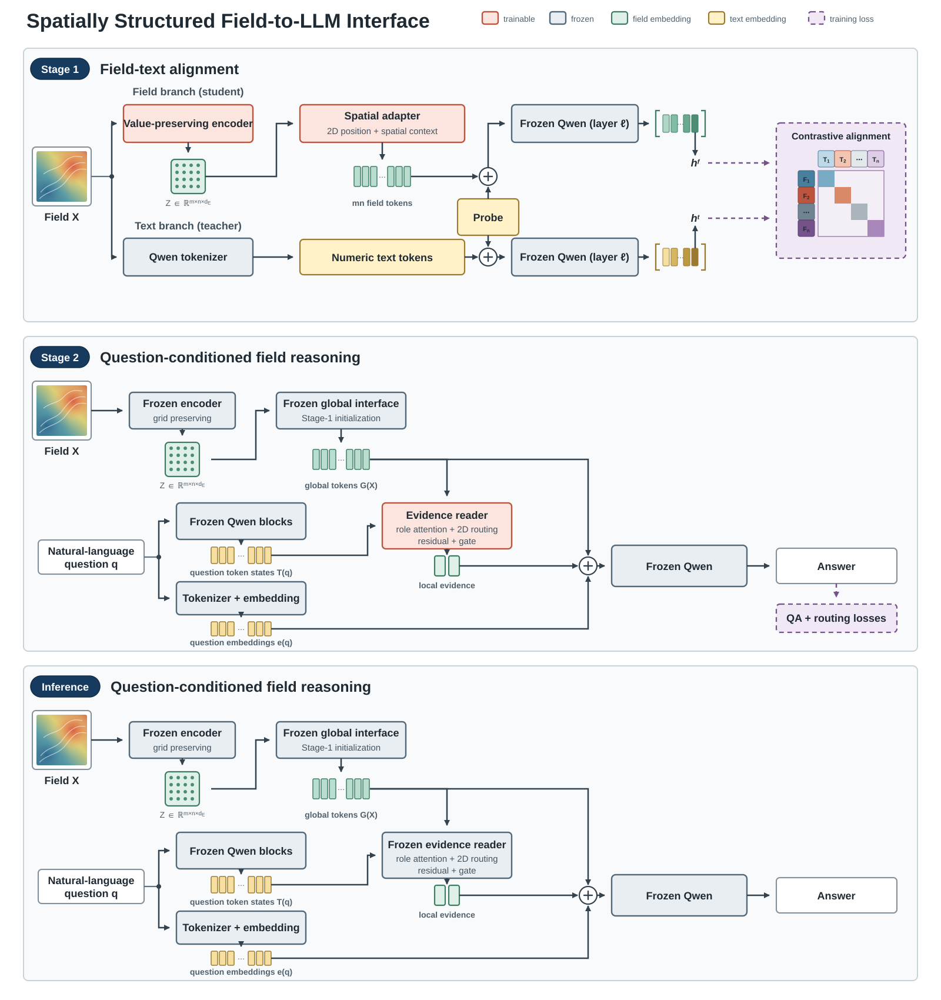

# Tensor-to-LLM 模型结构图说明与修改指南



## 图的核心信息

这张图表达的是当前正式的两阶段结构，而不是早期的 Q-Former、hybrid residual adapter 或 question-conditioned cross-attention 版本：

1. Stage 1 将一个不降采样、保留空间位置的 tensor 表示，对齐到冻结 Qwen 的浅层自然语言表示。
2. Stage 2 复用该表示，把 256 个连续 tensor embedding 直接放到自然语言问题之前，由冻结 Qwen 自己完成 tensor 与问题的交互。
3. QA 路径中没有 decoder、whitening、额外 projection head、坐标解析器或任务专用数值 head。

图中英文标题可译为“空间定位的 Tensor-to-LLM 接口”。其中 `spatial token` 是直接送入 `inputs_embeds` 的连续向量，不是 tokenizer 产生的正整数 token ID。

## Stage 1：表示对齐

### 1. 输入与归一化

对单字段的 `16 x 16` patch `X` 做逐 patch z-score：

```text
z = (X - mu) / sigma
```

Student 与 teacher 看到的是同一组归一化数值。Stage 1 的数值文本不含字段名、sample/time 元数据或任务标签，避免模型通过无关文本识别样本。

### 2. Value-preserving encoder

编码器不做空间下采样：

```text
E_phi: R^(1 x 16 x 16) -> R^(8 x 16 x 16)
```

- latent channel 0 精确保留归一化输入 `z`；
- channel 1--7 学习局部特征；
- 输入 cell `(r,c)` 与 latent 位置 `(r,c)` 保持直接对应；
- reconstruction 仅作为 Stage 1 训练正则，decoder 不进入 Stage 2 或推理路径。

当前配置下 encoder 会在 AE warmup 后继续以较小学习率参与 alignment；因此图中 Stage 1 encoder 标为 trainable。Stage 2 则冻结并缓存其 latent。

### 3. Spatial adapter

将 `Z` 按 row-major 顺序展平成 256 个 8 维 cell feature。对第 `i` 个位置：

```text
u_i = Linear_content(Z_i) + PE_2D(r_i, c_i)
C   = Transformer_2layers(u_1, ..., u_256)
p_i = 0.05 * tanh(Linear_out(LN(C_i + Linear_residual(Z_i))))
```

其中二维 sinusoidal position encoding 和 per-cell residual 的 scale 都是固定的 `1.0`，不能被训练关闭。最终得到：

```text
P = [p_1, ..., p_256] in R^(256 x d_LLM)
```

“一个 cell 对应一个 token”指的是 token 槽位和位置身份保持一一对应，并不表示 self-attention 后 `p_i` 只包含一个标量。经过 spatial attention 后，每个 `p_i` 都带有全局上下文；per-cell residual 则保留该位置的直接数值通路。

### 4. Student/teacher 对齐位置

两条路径使用完全相同的短 probe `q`：

```text
Student: [p_1, ..., p_256, q]
Teacher: [Tokenize(serialize(z)), q]
```

二者经过共享且冻结的 Qwen，并读取第 `\ell` 个 Transformer block 后最后一个 probe token 的 hidden state。设 `a_f`、`a_t` 分别是两条序列中最后一个 probe token 的位置，则：

```text
h_i^f = Qwen_1:ell([P_i, q])[a_f]
h_i^t = Qwen_1:ell([Tokenize(serialize(X_i)), q])[a_t]
```

这里对齐的是“语义角色相同的最后一个 probe token”，不是两条不同长度序列中数值相同的绝对 index。probe 后不附加答案，也没有答案词表、LM-head CE 或 teacher-logit distillation。

### 5. Stage 1 objective

Teacher hidden 拟合出的固定 whitening `W` 只用于 Stage 1 objective 和 retrieval 诊断。按当前配置，损失可概括为：

```text
L_stage1 = 1.00 * L_InfoNCE^W
         + 0.25 * L_centered-InfoNCE^W
         + 0.50 * L_centered-InfoNCE^native
         + 0.50 * L_branch-mean
         + 1.00 * L_reconstruction
```

双向 InfoNCE 内部的 i2t/t2i 权重为 `0.6/0.4`。`W` 不修改 soft token，不保存在 Stage 2 输入路径中；向 Stage 2 转移的是 encoder 与 native spatial adapter。

## Stage 2：自然语言 grounding

### 1. 直接 prefix

Stage 2 复用 Stage 1 的 encoder 和 spatial adapter：

- encoder 冻结，训练数据的 `Z` 可缓存；
- spatial adapter 从 Stage 1 checkpoint 初始化，全部约 `8.94M` 参数以小学习率更新；
- Qwen2.5-14B 的参数全部冻结。

实际 LLM 输入顺序为：

```text
inputs_embeds = [p_1, ..., p_256, Embed(natural-language question + options)]
```

自然语言问题不会先进入 spatial adapter。adapter 只看 `Z`；tensor token 与问题 token 的第一次交互发生在 Qwen 的 causal self-attention 中。对于需要恢复原始量纲的任务，`mu` 和 `sigma` 作为普通自然语言内容出现在问题中，而不是通过结构化数值接口注入。

### 2. 回答与训练目标

正式选择题路径读取 A/B/C/D 的 restricted logits。当前训练目标为：

```text
L_stage2 = 1.00 * L_choice-CE
         + 0.05 * L_LM-CE
         + 0.10 * max(0, margin + NLL_correct - NLL_no-latent)
```

`margin=0.1`。no-latent ranking 用同长度的零信息 prefix 作为负例；不把随机或 shuffled tensor 当作监督负例，因为错误 tensor 也可能恰好对应同一正确答案。

### 3. Grounding audit

图中的 audit 不是额外训练模块，而是验证模型是否真的使用 tensor 的评估：

- `correct`：正确 tensor；
- `shuffled`：来自其他样本的 tensor；
- `zero_latent`：把 encoder latent 置零后仍经过 adapter；
- `no_latent`：直接用零信息 soft prefix。

## 参数状态

| 模块 | Stage 1 | Stage 2 |
|---|---|---|
| z-score | 固定操作 | 固定操作 |
| Value-preserving encoder | trainable | frozen / cached |
| AE decoder | reconstruction-only | 不存在 |
| Spatial adapter | trainable | trainable, Stage-1 init |
| 2D position encoding | fixed buffer, scale=1 | fixed buffer, scale=1 |
| Per-cell residual scale | fixed buffer, scale=1 | fixed buffer, scale=1 |
| Qwen | frozen，执行至第 `\ell` 层 | frozen，执行完整模型 |
| Whitening `W` | fixed, loss-only | 不存在 |

## SVG 修改入口

源文件是 `figures/tensor_to_llm_architecture.svg`，画布为 `1800 x 1210`。SVG 顶部 `<style>` 中可统一修改字体、颜色、边框和箭头。

主要 CSS class：

- `.trainable`：橙红色，训练参数；
- `.frozen`：灰蓝色，冻结模块；
- `.fixed`：浅蓝色，固定操作或缓存；
- `.tensor`：绿色，tensor/continuous embedding；
- `.textual`：黄色，自然语言 token；
- `.loss-only`：紫色虚线，仅训练 objective 使用。

主要 SVG group ID：

为避免 Stage 1 过度拥挤，当前图面把显式 `Normalize` 节点和 reconstruction 分支省略了；这只是绘图层面的简化，不改变上文所述的训练实现与损失定义。

| ID | 内容 |
|---|---|
| `header`, `legend` | 标题与图例 |
| `stage1` | Stage 1 总面板 |
| `stage1-input-grid`, `input-split-stage1` | 共享输入 `X` 与上下分支 |
| `value-preserving-encoder` | 不降采样 encoder |
| `stage1-latent-grid` | `8 x 16 x 16` latent 输出 |
| `spatial-adapter-stage1` | 精简后的 256-token spatial adapter |
| `student-input-sequence` | Student 的 256 spatial tokens、拼接符号与 `Probe` |
| `qwen-tokenizer-stage1` | 冻结 Qwen tokenizer |
| `teacher-input-sequence`, `teacher-branch` | Teacher 的 numeric text tokens、拼接符号与 `Probe` |
| `shared-shallow-qwen`, `student-shallow-qwen`, `teacher-shallow-qwen` | 上下对齐的共享冻结 Qwen 第 `\ell` 层 readout |
| `student-hidden-vector`, `teacher-hidden-vector` | Qwen 输出向量示意 |
| `stage1-alignment-loss`, `contrastive-matrix` | 带 `F_i`/`T_i` 配对序列和对角正样本的 contrastive alignment 矩阵 |
| `stage1-checkpoint-transfer`, `stage-transfer` | 两阶段参数转移 |
| `stage2` | Stage 2 总面板 |
| `stage2-input-sequence` | 直接 `inputs_embeds` 拼接 |
| `full-frozen-qwen` | 完整冻结 Qwen2.5-14B |
| `natural-language-question` | 自然语言问题与选项 |
| `answer-output` | A/B/C/D restricted answer |
| `stage2-loss` | QA objective |
| `grounding-audit` | tensor 依赖评估 |

可直接用 Inkscape、Illustrator 或 Figma 导入 SVG。修改时应保留三条关键视觉关系：

1. 256 个 spatial token 与 text token 是同一条 `inputs_embeds` 序列；
2. Stage 2 的 question 绕过 adapter，只在 Qwen 内与 tensor 交互；
3. whitening 和 reconstruction 都没有进入 Stage 2 推理路径。

不要在图中加入当前正式实现不存在的 Q-Former、question cross-attention、decoder QA 路径、坐标 parser 或任务专用 numerical head。

## 推荐英文 caption

> **Overview of the spatially grounded tensor-to-LLM interface.** In Stage 1, a value-preserving encoder retains the normalized value at every grid location, and a spatial adapter maps the resulting 16 x 16 latent map to 256 continuous LLM tokens with fixed 2D positional encoding. The tensor prefix and a serialized-value teacher are aligned at the same probe position in a shared frozen shallow Qwen backbone; teacher-fitted whitening is used only by the alignment objective. In Stage 2, the native spatial adapter is initialized from Stage 1 and fine-tuned while the encoder and Qwen2.5-14B remain frozen. The 256 tensor embeddings are placed directly before a natural-language question, so tensor-question interaction occurs only through the LLM's causal self-attention.

## LaTeX 插图模板

建议作为 AAAI 双栏通栏图使用：

```latex
\begin{figure*}[t]
  \centering
  \includegraphics[width=\textwidth]{figures/tensor_to_llm_architecture.pdf}
  \caption{Overview of the spatially grounded tensor-to-LLM interface. In Stage 1, a value-preserving spatial representation is aligned with serialized numerical text in a frozen shallow LLM. In Stage 2, the resulting 256 tensor embeddings directly prefix the natural-language question and interact with text only inside the frozen LLM.}
  \label{fig:architecture}
\end{figure*}
```

用 Inkscape 导出论文 PDF 和高分辨率 PNG：

```bash
inkscape figures/tensor_to_llm_architecture.svg \
  --export-filename=figures/tensor_to_llm_architecture.pdf

inkscape figures/tensor_to_llm_architecture.svg \
  --export-width=3600 \
  --export-filename=figures/tensor_to_llm_architecture_2x.png
```
